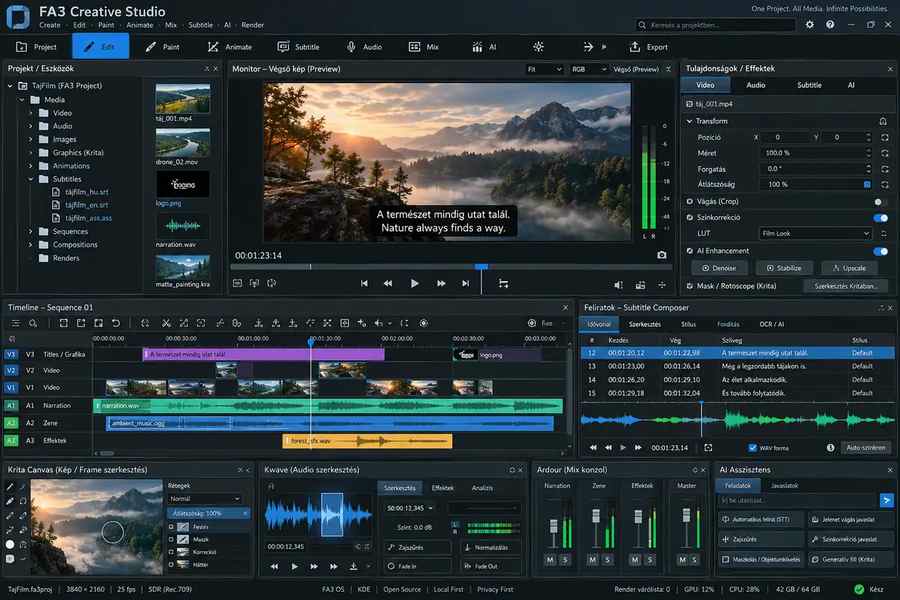
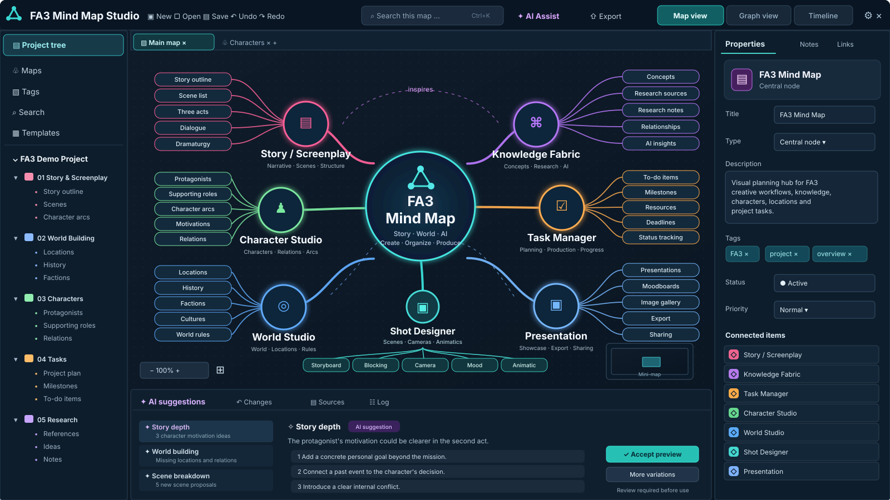
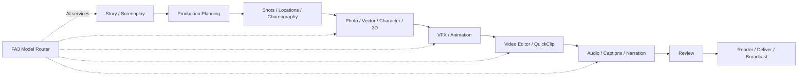

<div align="center">

# FA3 — Final Architecture

### A local-first Linux platform for creative production, AI-assisted workflows, media, automation and advanced computing.

**Photo · Video · Story · Mind Map · Vector · 3D · VFX · Animation · Audio · Production · AI**

<br>



<sub>FA3 Creative Studio — interface design preview</sub>

</div>

---

## What is FA3?

**FA3 (Final Architecture v3.0)** is a unified Linux platform that brings creative applications, AI-assisted tools, production workflows and the infrastructure behind them into one coherent system.

The goal is not to make users manage a collection of unrelated applications, model runtimes and hardware backends. FA3 presents focused applications and shared workflows while routing models, compute resources, providers, projects, evidence and automation through common platform services.

FA3 is designed to remain **local-first**, **provider-neutral** and **hardware-portable**. A conforming baseline can run CPU-only; accelerated workloads discover compatible hardware dynamically and use the FA3 resource-admission layer instead of assuming a particular GPU vendor, model or device number.

> **Screenshot status:** the interface images in this README are FA3 design previews. Individual applications and capabilities can be at different implementation, admission and current-host evidence stages. A screenshot is not runtime-promotion evidence.

---

# Applications

FA3 is organized around focused user-facing applications rather than exposing the collection of engines, providers and runtimes working behind them.

## Create & edit

### Photo & Image Studio

A unified image workflow for photography, RAW development, painting, compositing, retouching and frame/sequence work. Capability areas include non-destructive editing, masks/layers, color, panorama/HDR, restoration, sequence retouching, asset management and AI-assisted image operations.

### Video & Creative Studio

The FA3 video workflow is centered on the **FA3 Video Editor**, with its own project/timeline model and handoff to captions, audio, VFX, color, review and 3D/DCC workflows. **QuickClip** complements it for fast short-form editing and can hand work back to the main editorial model.

### Vector Studio

A Qt-native vector workspace for professional drawing, typography, path editing, illustration, reusable geometry and AI-assisted vector workflows, with broad professional interchange as a design goal.

<p align="center">
  
  <br><sub>Photo & Image Studio · Vector Studio · Creative / Video Studio — interface design previews</sub>
</p>

## Story / Screenplay Studio

FA3 treats screenplay work as a production system rather than a generic text editor. The Story/Screenplay fabric is designed for production-type-aware documents, branching story continuations, revisions, research, adaptation mapping, scene metadata, writing goals/statistics, production handoff and human-reviewed AI assistance.

The document model is intended to support feature films, television, episodic production, advertising/commercials, live production and future profiles instead of assuming one universal screenplay structure.

<p align="center">
  
  <br><sub>FA3 Story / Screenplay Studio — interface design preview</sub>
</p>


## Mind Map Studio

**FA3 Mind Map Studio** is a planned, AI-assisted visual mind-mapping and knowledge-graph editor for organizing ideas, research, stories, characters, locations and production tasks. Its editable map views are designed to connect with FA3 Story/Screenplay, Knowledge Fabric, Character Studio, World & Environment Studio, Shot Designer and Task Manager without replacing those applications' authoritative project data.

The proposed local-first Qt6/QML workspace combines a project tree, interactive map and graph canvas, node inspector and human-reviewed AI suggestions. A native `.fa3mind` project format and portable export paths are planned; model and resource use remain under the central Model Router and Host Resource Broker (HRB).

<p align="center">
  
  <br><sub>FA3 Mind Map Studio — GUI design concept; planned application, not an implemented or current-host-verified runtime</sub>
</p>

# Pre-production & world building

### Scene / Shot Designer

Shot planning, staging, cameras, actors, blocking, scene geometry and production-oriented previsualization share the same project context as the rest of the studio.

### World & Environment Studio

Environment design covers natural, architectural, historical and fictional settings — from rooms, streets, forests and oceans to historical periods, fantasy worlds, science-fiction environments and mixed settings.

### Character Studio

Character development connects visual design with 3D-ready character data, rig/pose/motion concepts and production assets rather than ending at a static image.

<p align="center">
  
  <br><sub>Scene / Shot Designer · World & Environment Studio · Character Studio — interface design previews</sub>
</p>

# Performance, VFX & production

### Choreography Studio

A spatial and temporal planning surface for performers, movement, blocking, timing, camera relationships and animation/production handoff.

### VFX Studio

A production-oriented effects workspace connecting compositing, node/graph workflows, particles, materials, procedural work, image/video assets and 3D interchange.

### Production Studio

The broader production surface ties together story, planning, assets, shots, editorial, review, delivery and supporting automation.

<p align="center">
  
  <br><sub>VFX Studio · Choreography Studio · Production Studio — interface design previews</sub>
</p>

Other focused FA3 surfaces include **Subtitle Studio**, **Narration Studio**, audio/music and voice workflows, animation/character motion, live/broadcast workflows, review, credits/titles, spatial/reconstruction workflows and the FA3 Control Center.

---

# One connected workflow



The applications are intended to share canonical project context and platform services instead of building isolated model, hardware and automation stacks inside every GUI.

---

# AI in FA3

FA3 uses a **central Model Router** rather than permanently wiring applications to one model or runtime. Applications request an admitted capability; model/provider selection remains behind the platform boundary.

That makes it possible to support local, remote or hybrid execution while keeping resource admission, provider compatibility and application permissions explicit. Accelerated local execution is coordinated with the **Host Resource Broker (HRB)** so applications do not directly claim arbitrary devices.

---

# Operating system

FA3 is a **Linux** platform.

| Support level | Environment |
| --- | --- |
| **Tier 1 reference** | KDE Plasma on Wayland |
| **Tier 2 supported targets** | COSMIC / Wayland, GNOME / Wayland, Cinnamon, XFCE, LXQt |
| **Tier 3 compatible targets** | Sway, Hyprland, MATE and other XDG-compatible environments when baseline admission passes |
| **Headless** | Supported for workflows that do not require a local GUI |

**Wayland is preferred. X11 remains supported.**

Portable FA3 desktop code targets the Generic Linux/XDG boundary. KDE/Qt integrations may provide deeper integration on KDE Plasma, but Plasma-specific behavior is not allowed to become a core dependency for other admitted desktops.

See [`docs/desktop-portability.md`](docs/desktop-portability.md).

---

# Minimum hardware

FA3 deliberately defines a **portable minimum envelope**, not one workstation model.

| Component | Canonical baseline |
| --- | --- |
| **CPU** | 1..N CPU packages; each qualifying CPU has at least **8 physical cores** |
| **Accelerator / GPU / NPU** | **0..N** — no accelerator is globally required |
| **CPU-only operation** | Supported by the global baseline |
| **GPU vendor** | No globally required vendor or product family |
| **Accelerated workloads** | Require a compatible discovered device and an HRB lease |
| **RAM** | No single global minimum is currently encoded; workload-dependent |
| **Storage** | No single global minimum is currently encoded; workload/project-dependent |

NVIDIA/CUDA, AMD/ROCm, Intel/Level Zero/oneAPI and other runtime requirements are **provider/workload-specific**, not global FA3 minimum requirements.

The hardware safety policy is fail-closed: FA3 must not turn a performance preference into an unsafe device setting, and unknown safe ranges do not authorize hardware mutation.

See [`canonical/hardware-portability-enforcement.json`](canonical/hardware-portability-enforcement.json).

---

# Architecture at a glance

The user-facing applications sit on top of shared FA3 platform authorities and contracts:

```text
Applications
Photo · Video · Story · Vector · 3D · VFX · Audio · Production
                         │
                         ▼
              Shared FA3 application fabric
                         │
        ┌────────────────┼────────────────┐
        ▼                ▼                ▼
   Model Router     Resource Broker   Action / Tool fabric
        │                │                │
        └────────────────┼────────────────┘
                         ▼
            Providers / runtimes / hardware
                         │
                         ▼
             Evidence & governed promotion
```

Current canonical capability baseline: **175 capabilities**.

The capability model separates documented architecture from runtime truth: documentation or a design preview cannot promote a runtime by itself. Provider admission, current-host evidence and promotion remain explicit.

See [`canonical/FA3-CAPABILITY-MODEL-175-001.json`](canonical/FA3-CAPABILITY-MODEL-175-001.json).

---

# Design principles

- **Local-first:** local execution and local project ownership remain first-class.
- **Provider-neutral:** applications consume capabilities instead of hard-coding one backend.
- **CPU-only is valid:** a GPU is not a global admission requirement.
- **Hardware-aware, not hardware-pinned:** live discovery and resource admission replace fixed workstation assumptions.
- **Native project data matters:** editable/native project structures should be preserved where the application owns them.
- **Software coexistence:** FA3 components must not require replacing or hijacking independently installed upstream applications.
- **Human-visible AI:** AI assistance must remain attributable and subject to the relevant workflow's approval rules.
- **Fail-closed promotion:** architecture, CI and current-host runtime evidence are not treated as interchangeable evidence.

---

# Repository and validation

This repository contains the architecture, canonical contracts, provider/admission records, gates, evidence model, application work and supporting tooling for FA3.

Common checks include:

```bash
./bin/fa3-enforce static
python3 ./bin/fa3-desktop-admission --self-test --json
./bin/fa3-enforce hardware-portability
```

Current-host evidence is intentionally separate from reference/static validation.

For deeper technical material, start with:

- [`docs/`](docs/) — architecture and integration documentation
- [`canonical/`](canonical/) — canonical profiles, contracts, policies and decisions
- [`evidence/`](evidence/) — evidence registry and current-host evidence machinery
- [`apps/`](apps/) — FA3 application surfaces
- [`tests/`](tests/) — executable regression coverage

---

# License & rights

FA3-original work in this repository is licensed under **Apache-2.0** unless a file or component explicitly states otherwise. Third-party software, models, datasets, assets, fonts, SDKs, codecs and services retain their own terms and are **not relicensed by FA3**.

FA3 treats licensing as a P0 release-safety property. The canonical **License & Rights Authority** keeps code, model, dataset, asset, service and generated-output rights separate; unknown required rights facts fail closed. The historical repository is currently subject to a retroactive rights audit, so release eligibility remains blocked until that audit reaches PASS.

See [`LICENSE`](LICENSE), [`NOTICE`](NOTICE), [`TRADEMARKS.md`](TRADEMARKS.md), [`COMMERCIAL-LICENSING.md`](COMMERCIAL-LICENSING.md), and [`docs/license-rights-management.md`](docs/license-rights-management.md).

---

<div align="center">

## FA3

**Create the work. Keep the project. Choose the compute. Preserve the evidence.**

</div>