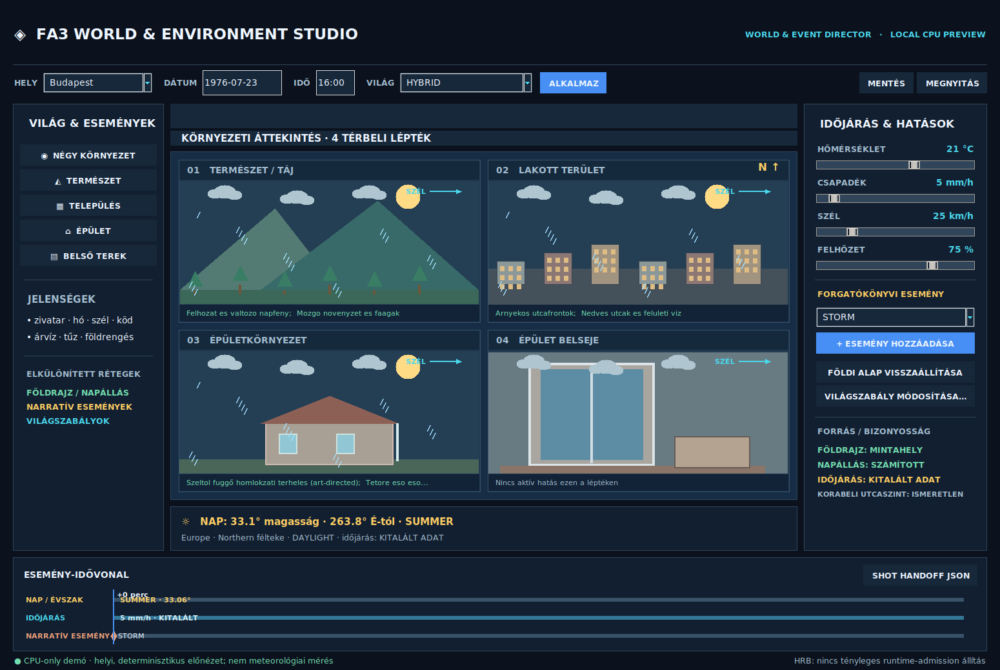

# FA3 World & Event Director — executable MVP

The FA3 World & Environment Studio's first working, **offline, CPU-only** creative preview for weather, season/daypart, narrative events and their visible consequences in **four spatial scopes**: natural landscape, city, building vicinity and interior. This is a genuine executable vertical slice, **not** a complete historical reconstruction system or a certified hazard simulation.



*Actual screenshot of the tested Tk desktop fallback. The Qt6/QML frontend is implemented from the same Python controller and requires runtime validation on a host with PySide6.*

## Run

```bash
# From repository root, on Linux; a Python venv is recommended for all optional packages.
python3 apps/fa3-world-event-director/launch.py --headless-preview
python3 apps/fa3-world-event-director/launch.py --gui tk

# Optional Qt 6 / QML frontend; install into a virtual environment, not the system Python.
python3 -m venv .venv-fa3-world
source .venv-fa3-world/bin/activate
python -m pip install 'PySide6>=6.6,<7'
python apps/fa3-world-event-director/launch.py --gui qt
```

The dependency-free core is available to headless jobs and offline previews. The runnable Tk frontend needs `python3-tk`; only the optional screenshot switch requires Pillow:

```bash
xvfb-run -a --server-args='-screen 0 1700x1140x24' \
  python apps/fa3-world-event-director/launch.py --gui tk \
  --screenshot docs/assets/readme/world-environment-studio-runtime.png
```

## What's functional

- Editable demo anchors for Budapest, Cape Town, Singapore, Nairobi and Tromsø, historical Gregorian date, local time and `zoneinfo` timezone; season follows hemisphere and does not falsely assign four seasons to equatorial/tropical regions.
- Approximate **CPU solar ephemeris** (altitude and true-north azimuth); 1976 Budapest has the correct historical UTC+1 rather than modern summer DST. Without a clock the instantaneous Sun angle is unknown.
- Four linked *actual vector-drawn GUI previews*: natural landscape, city, building exterior and interior. Live controls for temperature, precipitation, cloud cover and wind show deterministic **art-directed** weather effects, not observations or solver-validated hydrodynamics.
- Narratively authored storm, flood, fire, earthquake, snow, cloned dinosaur and alien event examples, with deterministic four-scale consequences and a simple event timeline.
- Real-location **Earth Anchor** and astronomical state persist across fictional story events. A two-sun planetary override requires an explicit dialog acceptance and then stops claiming the Earth ephemeris.
- `.fa3world` versioned JSON sidecar load/save and shot-handoff **metadata JSON** export with provenance and explicit non-editorial authority labels. These are MVP demonstration interchange formats, not admitted replacements for existing FA3 creative project formats.
- CPU-only headless CLI and 25 automated tests. No network access, GPU/vendor pinning, new AI model, fixed media backend or privilege needed.

## Boundaries

- Sample coordinates are demo points at city scale, **not period-certified historical street geometry**. The example day/hour weather sliders are marked `AUTHOR_INVENTED`; no 1976 observed weather or population is asserted.
- Qt/QML frontend code exists, but is **not claimed to be GUI-runtime-tested** until a compatible Qt host runs it. On systems without Qt, `--gui auto` falls back to the working Tk preview.
- The implementation does not directly call HRB or model providers: no real accelerator lease/current-host admission is claimed. Subsequent FA3 integration must use existing HRB, Model Router, Reuse Discovery, source/data rights checks and normal approval gates.
- A real weather feed, historical GIS/time-varying transport, 3D geometry/volumetric/render bridges, physically calibrated fluid/smoke/structure solvers, Bforartists/Video Editor native integration and disaster-response certification are **not** included in this first executable vertical slice.

## Test

```bash
python3 -m unittest discover -s tests -p 'test_world_event_director.py' -v
```

## Hardware Audit

CPU-only functional; accelerator cardinality `0..N`, no required GPU vendor, no new global resource authority. Qt6 QML targets generic Linux desktops, Wayland preferred and X11 supported where the selected Qt runtime supports them. Tk fallback additionally requires a working X display or XWayland. External solver/model/asset promotion needs independent license, security, coexistence and real current-host execution evidence.

The full architecture proposal remains in [`docs/world-event-director-application-plan-2026-09-28.md`](../../docs/world-event-director-application-plan-2026-09-28.md).
